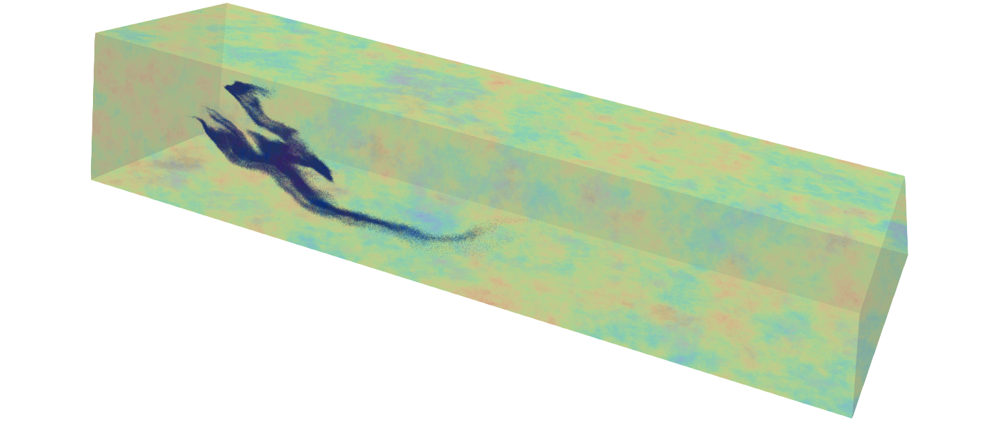

# modpath-rw
A Random Walk Particle Tracking Code for Solute Transport in Heterogeneous Aquifers



## Overview
MODPATH-RW is an extension of MODPATH-v7 implementing particles displacement based on the Random Walk Particle Tracking (RWPT) method. Code is built on top of MODPATH-OMP, so it can process particles in parallel using the OpenMP library. 

## Get the code
There are some external dependencies in the program. This means that while cloning, do it recursively to bring the latest version of these dependencies. 

```
git clone --recursive https://github.com/upc-ghs/modpath-rw.git
```

The external dependencies are stored in the ``lib`` folder: 

- [``gpkde``](https://github.com/upc-ghs/gpkde): module for smoothed reconstruction of concentrations.

- [``finterp``](https://github.com/jacobwilliams/finterp.git): module for linear interpolation.

- [``rng_par_zig``](https://bitbucket.org/LadaF/elmm/src/master/src/rng_par_zig.f90): module for random number generation in parallel with the ziggurat method. This file is included in the repo.


If you decide not to clone recursively, then be sure to bring the external dependencies and place them inside the ``lib`` folder. 

## Compilation
Makefiles are available at the `make` folder. Compilation has been verified with ``gfortran@>=9.2.1`` and with ``ifort`` from Intel ``oneAPI@2021.3.0``. For example, to compile with ``gfortran``

```
make -f makefile-gfortran-pc
```

By default, the compiled program is called ``mpathrw``. Compilation process will create an objects folder (``obj_temp``) where the compiled modules reside. When integrating program updates and recompiling, it is advised to remove this folder to avoid any inconsistencies. 

## Command line interface 
A command line interface with some simple instructions for running the program and parameters has been included. Asking for help (``mpathrw -h``) will display the following message

```
MODPATH-RW version *.*.*               
Program compiled MMM DD YYYY HH:MM:SS with ******** compiler (ver. *******)       

A Random Walk Particle Tracking code for solute transport in heterogeneous aquifers

usage:

  mpathrw [options] simfile

options:
                                                                                 
  -h         --help                Show this message                             
  -i         --init                Initialize simulation without running         
  -l  <str>  --logname    <str>    Write program logs to <str>                   
  -nl        --nolog               Do not write log file                         
  -np <int>  --nprocs     <int>    Run with <int> processes                      
  -p         --parallel            Run in parallel                               
  -ts <int>  --tsoutput   <int>    Selects timeseries output <int>               
  -s         --shortlog            Simplified logs                               
  -v         --version             Show program version                          
                                                                                 
For bug reports and updates, follow:                                             
  https://github.com/upc-ghs/modpath-rw  
```


## Parallel output for timeseries
Three different output protocols for timeseries running in parallel have been implemented. The protocol can be selected via the command line argument ``-tsoutput``:

- ``--tsoutput 1``: is the default format, output is performed into a single output unit with OpenMP thread exclusive clause (critical). Only difference versus a serial run is that the output file contains non-sorted particle indexes.
- ``--tsoutput 2``: timeseries records are written into thread specific binary units and then consolidated into a single file after each timeseries output time. Timeseries file generated with this format does not contains a file header.
- ``--tsoutput 3``: timeseries records are written into thread specific output units. Timeseries file header is only written to output unit related to the first thread ``1_example.timeseries``. Initial particle positions are also written to the file of the first thread.


## Input files
Users familiarized with [FloPy](https://github.com/modflowpy/flopy) are encouraged to write input files for MODPATH-RW with the extension [flopyrw](https://github.com/modflowpy/flopyrw). The latter is based on the classes for MODPATH-v7, adapted for specific MODPATH-RW requirements.


## Contributing
Follow the [contribution guidelines](readme/CONTRIBUTING.md) for this project.

## License
MIT License

## Resources

* [MODPATH](https://www.usgs.gov/software/modpath-particle-tracking-model-modflow)
* [MODPATH-v7](https://github.com/MODFLOW-USGS/modpath-v7)
* [MODPATH-OMP](https://github.com/upc-ghs/modpath-omp)
* [GPKDE](https://github.com/upc-ghs/gpkde)
* [flopy](https://github.com/modflowpy/flopy)
* [flopyrw](https://github.com/upc-ghs/flopyrw)
* [gfortran](https://gcc.gnu.org/wiki/GFortran)
* [Intel oneApi HPC toolkit](https://www.intel.com/content/www/us/en/developer/tools/oneapi/hpc-toolkit.html)
* [OpenMP](https://www.openmp.org/)
* [MIT License](https://mit-license.org/)
